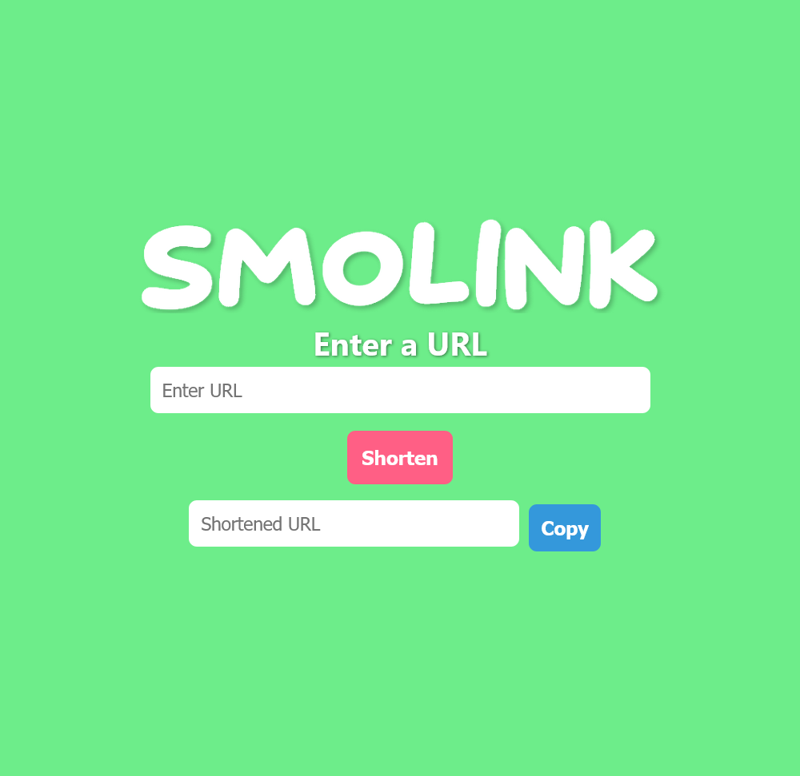
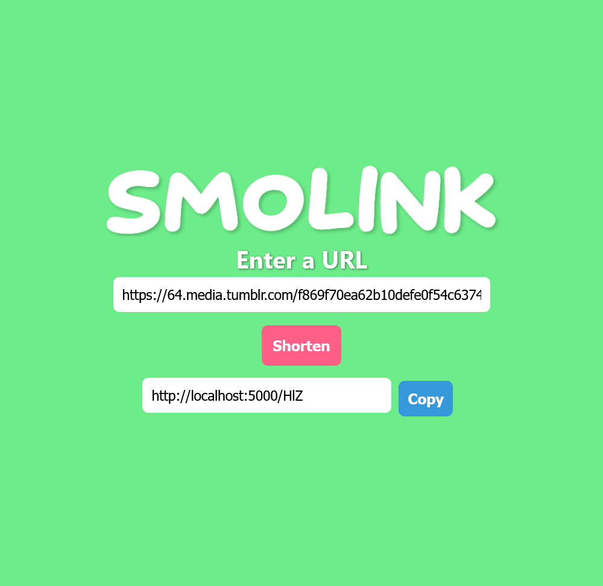

# Smolink: A URL Shortener

Smolink is a lightweight and user-friendly URL shortener application built with React, Flask and SQLite.

## Table of Contents

- [Features](#features)
- [Tech Stack](#tech-stack)
- [Installation](#installation)
  - [Server Installation](#server-installation)
  - [Client Installation](#client-installation)
- [Usage](#usage)
- [Screenshots](#screenshots)
- [Demo](#demo)
- [License](#license)

## Features

- Shorten long URLs into short, easy-to-share links
- Simple minimalistic user interface
- Copy button for easy sharing

## Tech Stack

- **Backend**: Flask & SQLite
- **Frontend**: React

## Installation

### Server Installation

To install and run the Smolink server (Flask) locally, follow these steps:

1. Clone this repository:

    ```
    git clone https://github.com/mespino4/smolink.git
    ```

2. Navigate to the `flask-server` directory:

    ```
    cd smolink/flask-server
    ```

3. Activate the Python virtual environment:

    ```
    source venv/bin/activate
    ```

4. Install dependencies:

    ```
    pip install -r requirements.txt
    ```

5. Run the Flask server:

    ```
    python run.py
    ```

### Client Installation

To install and run the Smolink client (React) locally, follow these steps:

1. In a second terminal navigate to the `react-client` directory:

    ```
    cd smolink/react-client
    ```

2. Install dependencies:

    ```
    npm install
    ```

3. Run the React development server:

    ```
    npm run dev
    ```

4. Access Smolink in your web browser, usually at `http://localhost:5173/`.

## Usage

To shorten a URL, follow these steps:

1. Open Smolink in your web browser.
2. Enter the long URL you want to shorten in the input field.
3. Click the "Shorten" button.
4. Copy the generated short link and share it with others.

## Screenshots


*Homepage of the Smolink application*


*Shorten a URL with Smolink*

## Demo


*A demonstration of how Smolink works.*

## License

This project is licensed under the [MIT License](LICENSE).
